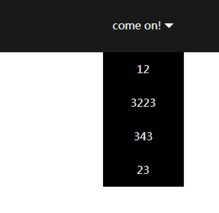

# hover下拉显示

   在做网页的时候有很多的菜单移上时显示

  + 给最外层元素添加`.menu`来设置移上区域的大小，`.triangle-up`是一个小方向箭头，可以根据具体情况添加或删除，`.list`是下拉选项。

  ```
    <div class="menu">
        <span>come on!</span>
        <span class="triangle-up"></span>
        <ul class="list">
            <li>12</li>
            <li>3223</li>
            ···
        </ul>
    </div>
  ```
  

  <a href='./relase/pulldown-menu.html'>点击查看代码</a>