# loading动画

### 类型一 .ball-beat

给元素添加 `.ball-bea`t类

```
<div class="ball-beat">
    <div></div>
    <div></div>
    <div></div>
</div>
```


### 类型二 .ball-clip-rotate-multiple

 给元素添加 `.ball-clip-rotate-multiple`类

```
<div class="ball-clip-rotate-multiple">
    <div></div>
    <div></div>
</div>
```

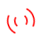

### 类型三 .ball-clip-rotate-pulse

给元素添加 `.ball-clip-rotate-pulse` 类

```
<div class="ball-clip-rotate-pulse">
    <div></div>
    <div></div>
</div>
```


### 类型四 .ball-clip-rotate

给元素添加 `.ball-clip-rotate` 类

```
 <div class="ball-clip-rotate">
    <div></div>
 </div>
```

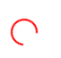

### 类型五 .ball-grid-beat

给元素添加一个`.ball-grid-beat` 类

```
<div class="ball-grid-beat" style="margin: 300px">
    <div></div>
    <div></div>
    <div></div>
    <div></div>
    <div></div>
    <div></div>
    <div></div>
    <div></div>
    <div></div>
</div>
```


### 类型六 .ball-grid-pulse

给元素添加`.ball-grid-pulse` 类

```
   <div class="ball-grid-pulse" style="margin: 300px">
        <div></div>
        <div></div>
        <div></div>
        <div></div>
        <div></div>
        <div></div>
        <div></div>
        <div></div>
        <div></div>
   </div>
```


### 类型七 .ball-pulse-rise

给元素添加 `.ball-pulse-rise` 类

```
   <div class="ball-pulse-rise">
    <div></div>
    <div></div>
    <div></div>
    <div></div>
    <div></div>
   </div>
```

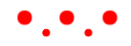

### 类型八 .ball-pulse-sync

给元素添加 `.ball-pulse-sync` 类

```
   <div class="ball-pulse-sync">
    <div></div>
    <div></div>
    <div></div>
   </div>
```


### 类型九 .ball-pulse

给元素添加`.ball-pulse` 类

```
<div class="ball-pulse">
    <div></div>
    <div></div>
    <div></div>
</div>
```

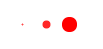

### 类型十 .ball-rotate

给元素添加 `.ball-rotate` 类

```
<div class="ball-rotate">
  <div></div>
  <div></div>
  <div></div>
</div>
```

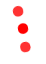

### 类型十一 .ball-scale-multiple

给元素添加  `.ball-scale-multiple` 类

```
<div class="ball-scale-multiple">
    <div></div>
    <div></div>
    <div></div>
</div>
```


### 类型十二 .ball-scale-ripple-multiple

给元素添加 `.ball-scale-ripple-multiple` 类

    ```
    <div class="ball-scale-ripple-multiple">
        <div></div>
        <div></div>
        <div></div>
    </div>
    ```

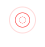

### 类型十三 .ball-scale-ripple

给元素添加 `.ball-scale-ripple` 类

    ```
    <div class="ball-scale-ripple">
        <div></div>
    </div>
    ```

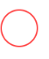

### 类型十四 .ball-scale

给元素添加 `.ball-scale` 类

```
<div class="ball-scale">
    <div></div>
    <div></div>
    <div></div>
</div>
```

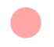

### 类型十五 .ball-spin-fade-loader

给元素添加 `.ball-spin-fade-loader` 类

```
<div class="ball-spin-fade-loader" style="margin: 300px">
    <div></div>
    <div></div>
    <div></div>
    <div></div>
    <div></div>
    <div></div>
    <div></div>
    <div></div>
</div>
```

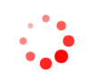

### 类型十六 .ball-triangle-path

给元素添加 `.ball-triangle-path` 类

```
<div class="ball-triangle-path">
    <div></div>
    <div></div>
    <div></div>
</div>
```

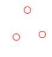

### 类型十七 .line-scale-party

给元素添加 `.line-scale-party` 类

```
<div class="line-scale-party">
    <div></div>
    <div></div>
    <div></div>
    <div></div>
</div>
```

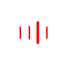

### 类型十八 .line-scale-pulse-out-rapid

给元素添加 `.line-scale-pulse-out-rapid` 类

```
<div class="line-scale-pulse-out-rapid">
    <div></div>
    <div></div>
    <div></div>
    <div></div>
    <div></div>
</div>
```


### 类型十九 .line-scale-pulse-out

给元素添加 `.line-scale-pulse-out` 类

```
<div class="line-scale-pulse-out">
    <div></div>
    <div></div>
    <div></div>
    <div></div>
    <div></div>
</div>
```

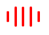

### 类型二十 .line-scale

给元素添加 `.line-scale` 类

```
<div class="line-scale">
    <div></div>
    <div></div>
    <div></div>
    <div></div>
    <div></div>
</div>
```

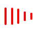

### 类型二十一 .line-spin-fade-loader

给元素添加 `.line-spin-fade-loader` 类

```
<div class="line-spin-fade-loader">
    <div></div>
    <div></div>
    <div></div>
    <div></div>
    <div></div>
    <div></div>
    <div></div>
    <div></div>
</div>
```


### 类型二十二 .pacman

给元素添加 `.pacman` 类

```
<div class="pacman">
    <div></div>
    <div></div>
    <div></div>
    <div></div>
    <div></div>
</div>
```


### 类型二十三 .spin-rotate

给元素添加 `.spin-rotate` 类

```
<div class="semi-circle-spin">
    <div></div>
</div>
```
- 效果

    360°旋转的半圆。

### 类型二十四 .square-spin

给元素添加 `.square-spin` 类

```
<div class="square-spin">
    <div></div>
</div>
```

- 效果

    正方形先以x轴顺时针方向旋转180°，再以y轴逆时针旋转180°。

### 类型二十五 .triangle-skew-spin

给元素添加 .triangle-skew-spin 类

```
<div class="triangle-skew-spin">
    <div></div>
</div>
```

- 效果

    等腰三角形以x轴逆时针方向旋转180°，再以y轴逆时针旋转180°，再以x轴顺时针旋转180°，再以y轴逆时针旋转180°

<a href="relase/loading.rar">点击下载代码</a>

参考链接：https://connoratherton.com/loaders