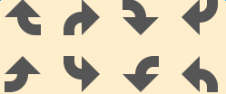
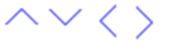
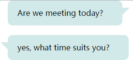
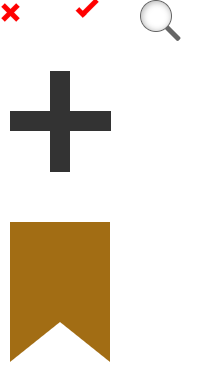

# 不规则图形

+ 多边形

    - 向上实心三角形

        给元素添加 `.triangle-up`类,可以根据具体情况修改 border属性，来改变其大小和颜色。

        ```
        <div class="triangle-up"></div>
        ```

    - 向下实心三角形

        给元素添加 `.triangle-down`类,可以根据具体情况修改 border属性，来改变其大小和颜色。

         ```
         <div class="triangle-down"></div>
         ```

    - 向左实心三角形

        给元素添加 `.triangle-left`类,可以根据具体情况修改 border属性，来改变其大小和颜色。

        ```
        <div class="triangle-left"></div>
        ```

    - 向右实心三角形

        给元素添加 `.triangle-right`类,可以根据具体情况修改 border属性，来改变其大小和颜色。

        ```
        <div class="triangle-right"></div>
        ```

    - 直角三角形

        给元素添加 `.triangle-bottomright`类,可以根据具体情况修改 border属性，来改变其大小和颜色。

        ```
        <div class="triangle-bottomright"></div>
        ```

    - 五角星

    给div添加一个 `.star-five`类,可以根据具体情况修改 border属性，来改变其大小和颜色。

    ```
   <div class="star-five"></div>
    ```

    

    <a href="./relase/triangle.html">点击查看代码</a>

+ 方向箭头（均需加上.arrow）

    - 指向左

      给元素添加 `.arrow-left`类

      ```
      <span class="arrow arrow-left"></span>
      ```

    - 指向上

       给元素添加 `.arrow-up`类

       ```
       <span class="arrow arrow-right"></span>
       ```

    - 指向右

       给元素添加 `.arrow-right`类

       ```
       <span class="arrow arrow-up"></span>
       ```

    - 指向下

        给元素添加 `.arrow-down`类

        ```
        <span class="arrow arrow-down"></span>
        ```

    

    <a href="./relase/solid-arrow.html">点击查看代码</a>

+ 转弯箭头(均需要加 .arrow)

    - 下转上

        给元素添加 `.arrow-up` 和 `.curve-right`

        ```
        <span class="arrow arrow-up curve-right">
            <span class="curve"></span>
        </span>
        ```

    - 下转右

        给元素添加 `.arrow-right` 和 `.curve-right`

        ```
        <span class="arrow arrow-right curve-right">
            <span class="curve"></span>
        </span>
        ```

    - 上转下

        给元素添加 `.arrow-down`  和 `.curve-right`

        ```
        <span class="arrow arrow-down curve-right">
            <span class="curve"></span>
        </span>
        ```

    - 上转左

        给元素添加 `.arrow-up` 和 `.curve-right`

        ```
        <span class="arrow arrow-up curve-right">
            <span class="curve"></span>
        </span>
        ```

    - 左转上

        给元素添加 `.arrow-up` 和 `.curve-right`

        ```
        <span class="arrow arrow-up curve-right">
            <span class="curve"></span>
        </span>
        ```

    - 上转右

        给元素添加 `.arrow-up` 和 `.curve-right`

    ```
    <span class="arrow arrow-up curve-right">
        <span class="curve"></span>
    </span>
    ```

    - 右转下

        给元素添加 `.arrow-up` 和 `.curve-right`

    ```
    <span class="arrow arrow-up curve-right">
        <span class="curve"></span>
    </span>
    ```

    - 下转左

        给元素添加 `.arrow-up` 和 `.curve-right`

    ```
    <span class="arrow arrow-up curve-right">
        <span class="curve"></span>
    </span>
    ```

     

    <a href="./relase/curve-arrow.html">点击查看代码</a>

+ 空心箭头

    - HTML

    ```
    <div class="arrow arrow-left"></div> //向左
    <div class="arrow arrow-top"></div> //向上
    <div class="arrow arrow-right"></div> //向右
    <div class="arrow arrow-bottom"></div> //向下
    ```

    - 向左 添加`.arrow-left`

    ```
    .arrow-left{
        -webkit-transform: rotate(-135deg);
        transform: rotate(-135deg);
    }
    ```

    - 向上 添加`.arrow-top`

    ```
    .arrow-left{
        -webkit-transform: rotate(-45deg);
        transform: rotate(-45deg);
    }
    ```

 - 向上 添加`.arrow-right`

    ```
    .arrow-right{
        -webkit-transform: rotate(45deg);
        transform: rotate(45deg);
    }
    ```

 - 向下 添加`.arrow-bottom`

    ```
    .arrow-bottom{
        -webkit-transform: rotate(135deg);
        transform: rotate(135deg);
    }
    ```

    

    <a href="./relase/hollow-arrow.html">点击查看代码</a>

+ bubble弹出框

    HTML

    ```
    <div class="bubble-box right"> //右侧bubble
        Are we meeting today?
    </div>
    <br />
    <div class="bubble-box left"> //左侧bubble
        yes, what time suits you?
    </div>
    ```

    

    <a href="./relase/bubble.html">点击查看代码</a>

+ 对勾  X号  放大镜 加号

    - 对勾

        给元素添加 `.fork`类

        ```
        <span class="del"></span>
        ```

    - X号

        给元素添加 `.del`类

        ```
       <span class="fork"></span>
        ```

         _注意：在给x号设置width时应为奇数.

    - 放大镜

        给元素添加 `.ex-search`类

        ```
        <span class="ex-search"></span>
        ```

    - ＋号

        给元素添加 `.cross`类

        ```
        <div class="cross"></div>
        ```

    - 书签

        给元素添加 `.bookmark`类

        ```
        <div class="bookmark"></div>
        ```

    

    <a href="./relase/checklist.html">点击查看代码</a>