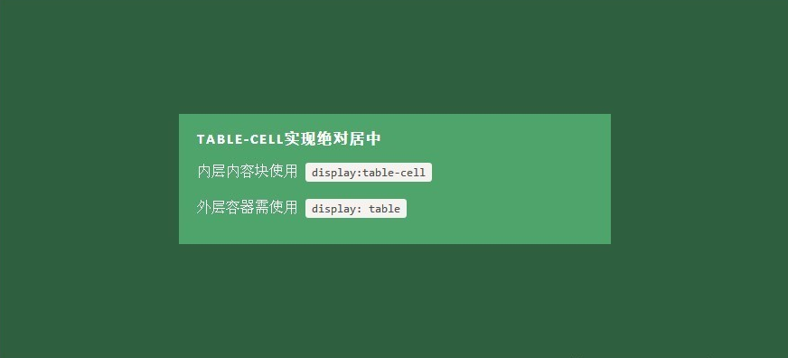

# 垂直,水平居中

+ 绝对定位

    - margin: auto(高度与宽度已知)

    ```
    .Absolute-Center {
      margin: auto;
      position: absolute;
      top: 0; left: 0; bottom: 0; right: 0;
    }
    ```

   - 负外边距(高度与宽度已知)

        这或许是当前最流行的使用方法。如果块元素尺寸已知，可以通过以下方式让内容块居中于容器显示：

        外边距margin取负数，大小为width/height（不使用box-sizing: border-box时包括padding，）的一半，再加上top: 50%; left: 50%;。即：

    ```
   .is-Negative {
           width: 300px;
           height: 200px;
           padding: 20px;
           position: absolute;
           top: 50%; left: 50%;
           margin-left: -170px; /* (width + padding)/2 */
           margin-top: -120px; /* (height + padding)/2 */
   }
    ```

  - trasform反向偏移（高度与宽度未知）
  这是最简单的方法，不近能实现绝对居中同样的效果，也支持联合可变高度方式使用。内容块定义transform: translate(-50%,-50%)必须带上浏览器厂商的前缀，还要加上top: 50%; left: 50%;

    ```
    .is-Transformed {
      width: 50%;
      margin: auto;
      position: absolute;
      top: 50%; left: 50%;
      -webkit-transform: translate(-50%,-50%);
      -ms-transform: translate(-50%,-50%);
      transform: translate(-50%,-50%);
    }
    ```

    <a href="./relase/center-absolute.html">点击查看代码</a>

+ flexbox（高度与宽度未知，但是要注意兼容性）

    <a href="./relase/center-flexbox.html">点击查看代码</a>

+ 表单单元格（高度与宽度未知）

    总的说来这可能是最好的居中实现方法，因为内容块高度会随着实际内容的高度变化，浏览器对此的兼容性也好。
    最大的缺点是需要大量额外的标记，需要三层元素让最内层的元素居中。

    

    <a href="./relase/center-table.html">点击查看代码</a>

    <a href='http://blog.csdn.net/freshlover/article/details/11579669'>垂直水平居中参考链接</a>