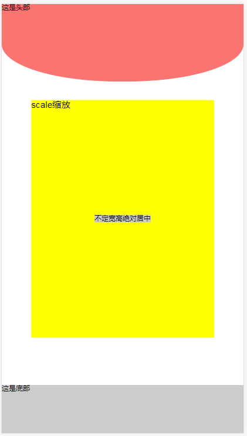

# 单屏
---
> 手机端的单屏模板包含了上中下布局、scale缩放，内容不设置宽高的绝对居中



<a href="release/single.rar">点击下载demo</a>
## 单屏实例
### 1. 引入文件
```
css/common.css
js/main.js
js/scale.js
```
### 2.HTML
```
<div class="g-m-wrap">
	<header class="g-header">
	</header>
	<div class="g-content">
		<div id="scale_box" class="scale-box">
			scale缩放
		</div>
		<div class="g-mediacy">
			不定宽高绝对居中
		</div>
	</div>
	<footer class="g-foot"></footer>
</div>
```

* 包裹项`.g-m-wrap` 实现竖上中下的布局，必填参数

- 顶栏`.g-header`与底栏 `.g-foot`固定宽高，必填参数
+ 中间内容项`.g-content`实现高度自适应,必填参数

* 缩放元素添加 `.scale-box` 和 `#scale_box` 注意该处的`height` `width`表示元素实际的尺寸对应的像素值,必填参数
```
    .scale-box{
            height:315px;
            width: 242px;
            position: absolute;
            background: #FFFF00;
            left: 50%;
            top: 50%;
        }
```
### 3. Javascript

*  `scale.js`中的320为实际psd的屏幕尺寸，项目中需修改该项值
```
	var rexScale = screenX / 320;
```


