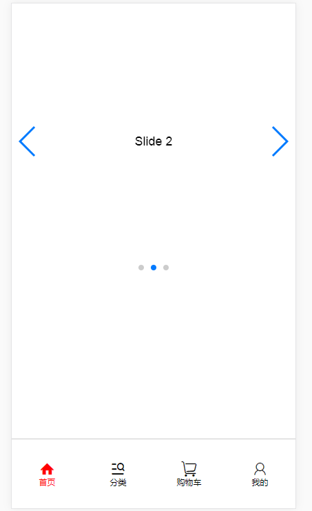

# 单屏滑动
---
> 此单屏页面不同于上面一种，该结构底部固定，当内容高度大于屏幕高度时，内容这块会出现滚动条。模板中还引用了swiper轮播图，使用事需引用swiper.min.css，swiper.min.js和zepto.js或jquery.js



<a href='release/mobile-single.rar'>点击下载demo</a>
## 单屏滑动实例

### 1. 引入文件

```
scss/animate.css
scss/swiper.min.css
js/zepto.min.js
js/swiper.min.js
```
### 2.HTML
```
<div class="g-content">
    <div class="swiper-container">
        <div class="swiper-wrapper">
            <div class="swiper-slide">Slide 1</div>
        </div>
        <!-- 分页器 -->
        <div class="swiper-pagination"></div>     
        <!-- 导航按钮 -->
        <div class="swiper-button-prev"></div>
        <div class="swiper-button-next"></div>       
        <!-- 滚动条 -->
        <div class="swiper-scrollbar"></div>
    </div>
</div>
<div class="g-footer">
      <!-- 底部导航 -->
	<a href="" class="m-page">
		<i class="icon iconfont active">&#xe778;</i>
		<p class="name active"首页</p>
	</a>
</div>
```

+ body添加`flex`，实现上下布局,必填参数

- 底栏`.g-footer`，固定宽高，设置flex属性，必填参数
* 导航元素`.m-page`，设置flex属性，实现垂直排列布局，必填参数

### 3. Javascript
```        
  var mySwiper = new Swiper ('.swiper-container', {
    direction: 'vertical',
    loop: true,
    
    // 分页器
    pagination: '.swiper-pagination',
    
    // 前进后退按钮
    nextButton: '.swiper-button-next',
    prevButton: '.swiper-button-prev',
    
    // 滚动条
    scrollbar: '.swiper-scrollbar',
  })        
```
[swiper官方API](http://www.swiper.com.cn/api/index.html)