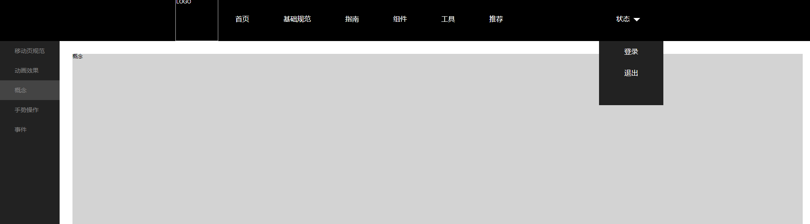

# 管理平台
----
> 该模板包含`导航栏`、`tab切换`常见的模块，按项目要求而自行选择



<a href="../model/release/pc-manage.rar">点击下载demo</a>

## 导航栏实例
### 1. HTML
```
  <li class="nav-item nav-status">
      <ul class="m-center">
          <li>登录</li>
          <li>退出</li>
      </ul>		
  </li>
```

  + 基于`li` 并添加`nav-status`,或者声明为`position: relative` 的其它页面元素。
* 为下拉菜单的添加`.m-center`，默认样式是可以让菜单向下展开


## tab切换实例
### 1. HTML
```
<ul class="g-menu" id="menu">
  <li>移动页规范</li>
  <li>动画效果</li>
</ul>
<div class="g-content">
 <p>移动页规范</p>
</div>
<div class="g-content">
 <p>动画效果</p>
</div>
```

+ 包裹项`ul`添加`#menu`, 必填参数
- 内容项元素添加 `.g-content`，必填参数
### 2. Javascript

* 控制对应面板的显示与隐藏