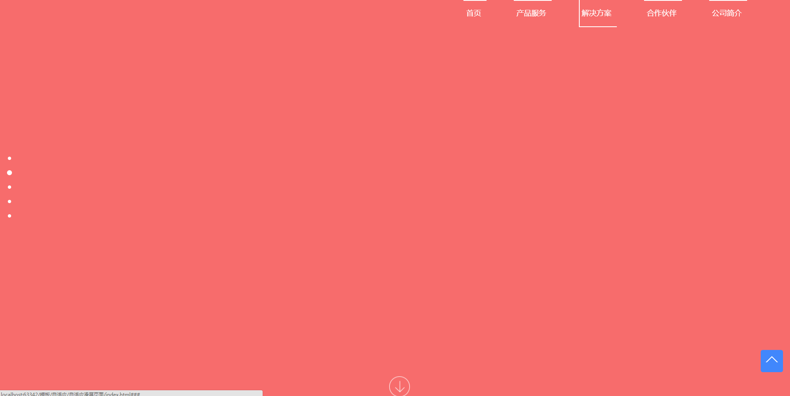

# 自适应滑屏页面
> 此模板适用手机端与PC端，除了常见的滑动效果还包含`返回顶部`、`分页`、`下箭头拉动效果`等效果.



<a href="release/media-slider.rar">点击下载demo </a> 

## 自适应滑屏实例

### 1. 引入文件

```
css/swiper.min.css
css/animate.min.css
js/swiper.min.js
js/swiper.animate.min.js
js/main.js
```

### 2. HTML
```
<div class="g-swiper-container">
  <div class="swiper-container">
      <div class="swiper-wrapper">
          <div class="swiper-slide">Slide 1</div>
          <div class="swiper-slide">Slide 2</div>
          <div class="swiper-slide">Slide 3</div>
      </div>
      <!-- 分页器 -->
      <div class="swiper-pagination"></div>
      
      <!-- 导航按钮 -->
      <div class="swiper-button-prev"></div>
      <div class="swiper-button-next"></div>
      
      <!-- 滚动条 -->
      <div class="swiper-scrollbar"></div>
       <!-- 导航列表 -->
      <header>
          <ul>
            <li class="m-items-link">
            <a href="###"></a>
          </li>
          </ul>
      </header>
      <!--返回顶部-->
      <div class="g-back-top back-btn">
        <b class="top">
        <i class="top-arrow1"></i><i class="top-arrow2"></i>
        </b>
      </div>
  </div>
</div>
```

- 给Swiper定义大小，可缺省。

```
.swiper-container {
  width: 600px;
  height: 300px;
}
```
### 3. Javascript
+ 按钮元素添加`.back-btn` 实现返回顶部功能

```
$(".back-btn").click(function(){
  mySwiper.slideTo(0, 500, false);//切换到第一个slide，速度为.5秒
  $(".back-btn").hide()	
})
```
+ 初始化Swiper

```        
  var mySwiper = new Swiper ('.swiper-container', {
    direction: 'vertical',
    loop: true,
    
    // 如果需要分页器
    pagination: '.swiper-pagination',
    
    // 如果需要前进后退按钮
    nextButton: '.swiper-button-next',
    prevButton: '.swiper-button-prev',
    
    // 如果需要滚动条
    scrollbar: '.swiper-scrollbar',
  })        
```

[参考链接](http://www.swiper.com.cn/)

