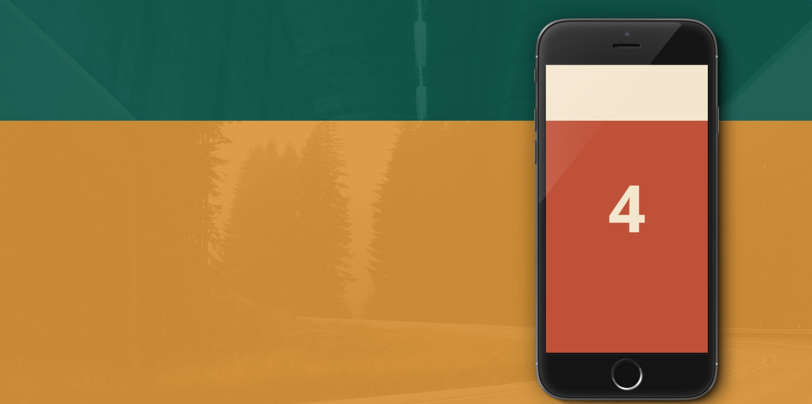

## 视觉差滚动特效
---
> 这是一款非常实用的jQuery和CSS3网页固定背景视觉差特效插件。该固定背景特效可以在页面中固定某些元素，在页面滚动的时候可以修改这些元素的视觉效果，从而制作出一种滚动视觉差的特效。



<a href="release/parallax-scrolling.rar">下载demo</a> 

#### 视觉差滚动实例

### 1. 引入文件

```
css/parallax.css
js/jquery.min.js
js/parallax.js
```
### 2. HTML

```
<section class="cd-fixed-background img-1" data-type="slider-item"></section>
<section class="cd-fixed-background img-2" data-type="slider-item"></section>
<section class="cd-fixed-background img-3" data-type="slider-item"></section>
```
* 元素添加`.cd-fixed-background`实现单页面的背景固定和滚动效果。可选参数 
+ 元素添加`data-type="slider-item"`，必选参数

### 3. Javascript
* 添加与移除`.is-visible`

